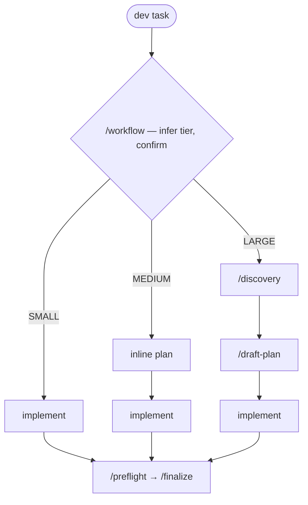

# agentic-toolkit

[](https://github.com/jabworks/agentic-toolkit/actions/workflows/ci.yml)
[](./skills/toolkit-research-frontier/references/eval-trials-2026-07-09.md)

Personal collection of agentic coding skills. Compatible with Claude Code, Codex, OpenCode, Cursor, Gemini CLI, and [40+ other tools](https://github.com/vercel-labs/skills) via `npx skills add`.

## Skills

| Skill                                        | Description                                                                                           |
| -------------------------------------------- | ----------------------------------------------------------------------------------------------------- |
| [session-report](./skills/session-report/)   | Generate an explorable HTML report of session usage — tokens, cache, cost, subagents, skills          |
| [session-handoff](./skills/session-handoff/) | Preserve and restore session context across agentic coding sessions                                   |
| [plugin-foundry](./skills/plugin-foundry/)   | Create and maintain skills in this toolkit                                                            |
| [adapting-skills](./skills/adapting-skills/) | Developer profile priors for adapting skills to Harvey's stack _(personal — useful to collaborators)_ |
| [git-commit](./skills/git-commit/)           | Conventional-commit message from the diff, run safely — review before staging, no blind `git add .`   |
| [git-operations](./skills/git-operations/)   | Decision router for git — pick the right operation (undo/discard/stash/merge/push) with an undo path  |
| [spec-browser](./skills/spec-browser/)       | Catalog and browse a specs/ tree — markdown index + folder-grouped doc site                           |
| [release](./skills/release/)                 | Cut releases safely — machinery detection (changesets/toolkit/GitHub), dry-run first, rollback paths  |

### Condux

Lean agentic workflow plugin (`condux`). Install the full workflow bundle as a unit:

```bash
/plugin install condux@jabworks-agentic-toolkit
```

> Inspired by [obra/superpowers](https://github.com/obra/superpowers) — condux reworks its skill-orchestration ideas around a lean, proportional-effort philosophy (tiered routing, lazy loading, soft gates) rather than always-on maximalism.

#### Why condux

Most workflow frameworks are maximal — every gate runs on every task, so a typo
fix pays the same ceremony as a cross-cutting refactor. Condux inverts that with
five operating rules:

1. **Proportional, not maximal** — the process tier matches the task size.
2. **Lazy loading** — downstream skills load only when their step is reached,
   keeping context (and cost) small.
3. **Soft gates, not hard walls** — a gate can be skipped, but only consciously:
   the agent asks before bypassing, never silently.
4. **The user is in control** — explicit instructions always beat the framework;
   "treat this as LARGE" or "skip the plan" is always valid.
5. **Implement yourself by default** — subagents are the exception and need a
   concrete justification, never spawned to fill time.

The payoff: no over-engineered button changes, no under-planned refactors,
predictable checkpoints where *you* drive every transition, and a small context
footprint because only the skills a tier actually needs ever load.

#### The flow

Every dev task enters through `/workflow`. It infers a tier from the task
(file count, design clarity, boundary crossings), confirms it with you, then
runs the matching pipeline:

| Tier | Looks like | Flow |
|---|---|---|
| **SMALL** | isolated change, 1–3 files, clear requirements | implement → `/preflight` → `/finalize` |
| **MEDIUM** | multi-file, some design needed, known boundaries | inline plan → implement → `/preflight` → `/finalize` |
| **LARGE** | cross-cutting, unclear scope, multiple subsystems | `/discovery` → `/draft-plan` → implement → `/preflight` → `/finalize` |



Every tier ends with `/preflight` (an "am I actually done?" checklist) and
`/finalize` (typecheck → lint → format → test, in order, once, stopping on the
first failure) — quality checks run at the end, not scattered mid-implementation.

**Checkpoints** (MEDIUM/LARGE only): at each phase boundary the agent stops and
presents a menu — after the plan (start implementing / tests-first / spawn
agents / revise), after implementation (verify & finalize / code review / keep
building), and after everything is green (review / commit / release / done).
The agent never auto-advances past a checkpoint; SMALL runs linear with no menus.

**Named agents**: four specialists ship with the bundle — `explorer` (read-only
codebase navigation), `researcher` (external API/library verification),
`planner` (design → executable plan), and `coder` (executes a provided plan).
Pipeline: explorer/researcher gather → planner plans → coder executes →
finalize validates. The default is still to implement directly — agents are
opt-in at checkpoints or justified by genuinely parallel work.

#### The skills

| Skill | Description |
|---|---|
| [/workflow](./skills/workflow/) | Tier router — infer Small/Medium/Large, confirm with user, load only the skills the tier needs |
| [/discovery](./skills/discovery/) | Design gate — clarifying questions, alternatives, section-by-section sign-off, saves the design doc before planning |
| [/draft-plan](./skills/draft-plan/) | Lean task-card plan (what/why/gotchas/deps), Markdown, LARGE tasks only |
| [/test-first-development](./skills/test-first-development/) | Opt-in tests-first — one upfront consent, then red-green-refactor; asks before editing existing specs |
| [/subagent-execution](./skills/subagent-execution/) | Named specialist agents for LARGE plans, only when justified, never to fill time |
| [/subagent-deployment](./skills/subagent-deployment/) | Fan out independent tasks across named agents in one message — ad-hoc, not a formal plan |
| [/finalize](./skills/finalize/) | End-of-task quality gate — typecheck → lint → format → test, once, stop on first failure |
| [/code-review](./skills/code-review/) | On-request diagnostic report (Critical/Important/Minor), never auto-triggers, never fixes |
| [/preflight](./skills/preflight/) | "Am I actually done?" checklist before finalize — catches skipped steps and regressions |
| [/root-cause-analysis](./skills/root-cause-analysis/) | Root-cause-first bug investigation — enforces the 4-phase sequence before any fix |
| [/technical-spec](./skills/technical-spec/) | Scaffold and persist feature specs (decisions, API, fields, quirks) with a live HTML preview |
| [/plan-review](./skills/plan-review/) | Annotate a plan in a local browser with a categorized comment toolbar, then return approve/revise/deny to the agent — auto via a Claude Code ExitPlanMode hook or a Codex Stop hook, or manually. Self-contained, no egress |

### Toolkit Ops

Repo-maintenance bundle (`toolkit-ops`) for working on this toolkit itself:

```bash
/plugin install toolkit-ops@jabworks-agentic-toolkit
```

| Skill | Description |
|---|---|
| [toolkit-orientation](./skills/toolkit-orientation/) | Zero-context map of the repo — trees, bundles, manifest pairing, docs trust order |
| [toolkit-change-control](./skills/toolkit-change-control/) | Classify a change, pick the version bump, gate on the publish checklist |
| [toolkit-skill-standards](./skills/toolkit-skill-standards/) | Frontmatter budgets, trigger contract, progressive disclosure, collision scan |
| [toolkit-debugging-playbook](./skills/toolkit-debugging-playbook/) | Symptom → discriminating command → root cause for skill/plugin problems |
| [toolkit-failure-archaeology](./skills/toolkit-failure-archaeology/) | Git-evidenced incident ledger — don't re-fight settled battles |
| [toolkit-plugin-reference](./skills/toolkit-plugin-reference/) | Verified plugin.json / marketplace.json schema, Claude↔Codex divergences |
| [toolkit-research-frontier](./skills/toolkit-research-frontier/) | Open problems, assets, next steps, and the library-health campaign |

## Evals

The skills are eval-tested for **trigger routing** — given a user query, does
the right skill activate (and does nothing activate when nothing should)?
Latest run (2026-07-09, claude-haiku-4-5, 394 cold-trigger cases, 3 trials):

- **88.7% ± 4.7pp** mean routing accuracy (95% CI, t-distribution); per-run
  89.8% / 86.5% / 89.8%, 44 flaky cases recorded
- Per-skill breakdown and the full miss list live in the
  [trial record](./skills/toolkit-research-frontier/references/eval-trials-2026-07-09.md)

This measures whether skills *activate correctly* — not end-to-end workflow
quality. Structural invariants (dist mirror, manifests, frontmatter budgets,
no-egress guarantees) are separately enforced by `node --test` in CI.

## Acknowledgments

The **plan-review** skill is inspired by [Plannotator](https://github.com/backnotprop/plannotator) — its interactive plan-review workflow served as the design reference. plan-review is an independent in-house reimplementation with no shared code and no third-party runtime dependency.

## Install

`npx skills add` auto-detects the running agent and installs to the right directory:

```bash
npx skills add jabworks/agentic-toolkit
```

This works inside Claude Code, Codex, OpenCode, Cursor, and most other agentic tools — no flags needed.

### Claude Code — plugin marketplace

Alternatively, register as a plugin marketplace to install individual skills:

> Via CLI:

```bash
claude plugin marketplace add jabworks/agentic-toolkit
claude plugin install session-handoff@jabworks-agentic-toolkit # claude plugin install session-handoff
claude plugin install plugin-foundry@jabworks-agentic-toolkit # claude plugin install plugin-foundry
```

> Via Claude Code CLI:

```bash
/plugin marketplace add jabworks/agentic-toolkit
/plugin install session-handoff@jabworks-agentic-toolkit # /plugin install session-handoff
/plugin install plugin-foundry@jabworks-agentic-toolkit # /plugin install plugin-foundry
```

> Via Claude Code CLI plugin menu:

```bash
/plugin
-> Marketplaces tab -> Add Marketplace -> jabworks/agentic-toolkit
-> Discover tab -> Search plugin name
```

### Codex — plugin manifests

This repo is also Codex plugin compatible:

> Via CLI:

```bash
codex plugin marketplace add jabworks/agentic-toolkit
codex plugin add session-handoff@jabworks-agentic-toolkit
codex plugin add plugin-foundry@jabworks-agentic-toolkit
```

> Via Codex CLI plugins menu:

```bash
/plugins
-> Add Marketplace -> jabworks/agentic-toolkit
-> Select jabworks/agentic-toolkit tab to add plugins
```

### Manual fallback

If running outside an agent environment, clone and copy to your tool's skills directory:

| Tool        | Skills directory             |
| ----------- | ---------------------------- |
| Claude Code | `~/.claude/skills/`          |
| Codex       | `~/.codex/skills/`           |
| OpenCode    | `~/.config/opencode/skills/` |
| Cursor      | `~/.cursor/skills/`          |
| Gemini CLI  | `~/.gemini/skills/`          |
| Most others | `.agents/skills/`            |

```bash
git clone https://github.com/jabworks/agentic-toolkit /tmp/agentic-toolkit
cp -r /tmp/agentic-toolkit/skills/<name> <skills-directory>/
```

## Structure

```text
skills/<name>/          # Editable source — also what `npx skills add` installs
dist/plugins/<name>/    # Built plugin dirs — the plugin-marketplace install source
.claude-plugin/
  marketplace.json      # Plugin registry (Claude Code / Codex marketplace channel)
```

Two distribution channels read two different trees:

- **`npx skills add`** (`vercel-labs/skills`, 68+ agents) scans the top-level
  `skills/<name>/SKILL.md` layout — it installs straight from **`skills/`** and
  ignores `dist/`.
- **`/plugin install …@jabworks-agentic-toolkit`** (Claude Code / Codex native)
  reads `.claude-plugin/marketplace.json`, whose `source` paths point at the
  assembled plugin dirs under **`dist/`**.

`dist/` is a build artifact mirrored from `skills/` via `scripts/sync.sh` — never
edit it by hand; `node --test` (run in CI) fails if it drifts from source. After
cloning, `bash scripts/install-hooks.sh` installs a pre-commit hook that syncs and
stages `dist/` automatically.
