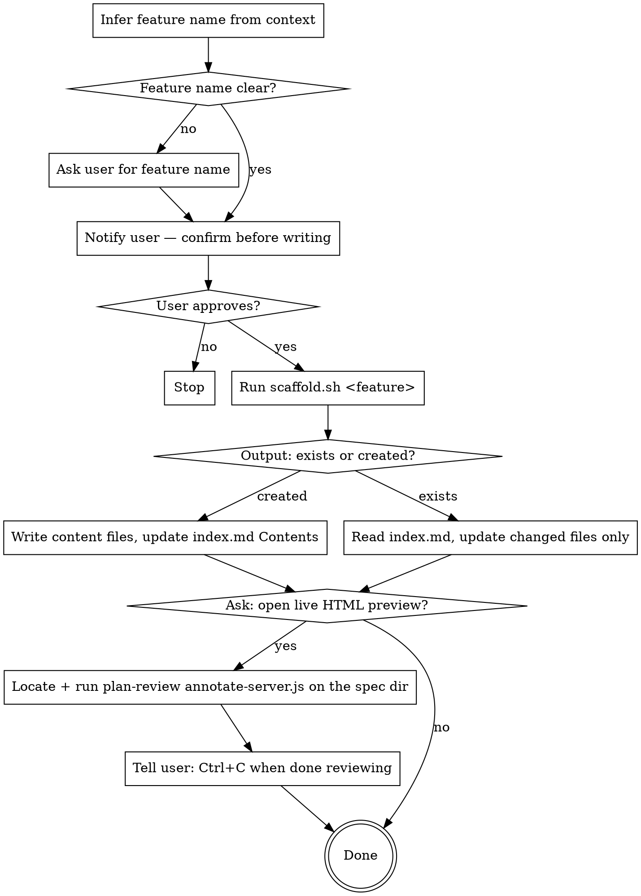

# Save Tech Spec

## Overview

Persists feature decisions, API contracts, implementation details, and quirks into a structured, queryable spec tree. One folder per feature, one file per concern — future sessions load only what they need. Specs are living contracts: `/preflight`'s Drift Check compares the implementation against them at end-of-task.

## Spec Folder Layout

All specs live under one `specs/` tree at the **git root**, mirroring the
repo structure. The scaffold script detects the nearest package root (walking
up from CWD to the git root, finding the first `package.json`, `Cargo.toml`,
`go.mod`, or `pyproject.toml`) and uses its path *relative to the git root*
to place the spec.

```
<git-root>/specs/
  {feature-slug}/           # cross-cutting, or scaffolded from the repo root
  apps/web/
    {feature-slug}/         # scaffolded while working in apps/web
      index.md              # TOC, last updated, commit hash, changelog  ← scaffold creates this
      decisions.md          # Design decisions with context + rationale
      api.md                # Endpoints, types, external APIs consumed
      fields.md             # Field mappings: BE/3rd-party → UI, or forwarding chains
      implementation.md     # Key files, patterns, how it hangs together
      quirks.md             # Edge cases, gotchas, known issues
```

Slugs are kebab-case and acronym-aware: `WanConfig` → `wan-config`,
`UIFormControls` → `ui-form-controls`.

In a single-package repo the package root is the git root, so specs land at
`specs/<slug>/`. In a monorepo working on `apps/web`, they land at
`specs/apps/web/<slug>/` — one browsable tree, with a natural home for
cross-cutting features at `specs/<slug>/`.

Existing specs co-located inside packages (`apps/web/specs/…`) are not
auto-migrated — `git mv` them into the root tree if you want them unified.

Only create files that have actual content. Don't create empty files.

## Workflow



## Required Notifications

Always announce and confirm before writing or editing. Never silently modify files.

New spec:
```
About to save tech spec for `wan-config` → specs/wan-config/
Proceed? [y/n]
```

Updating existing spec:
```
Updating spec for `wan-config` (last saved: 2026-06-20, commit abc1234)
Files to update: decisions.md, quirks.md
Proceed? [y/n]
```

## Running the Scaffold Script

The script lives next to this skill file. Find it relative to where this SKILL.md was loaded from:

```bash
bash path/to/skill/references/scaffold.sh "WanConfig"
```

The script outputs one line:
- `created:/abs/path/to/specs/wan-config commit:abc1234 date:2026-06-24` — new spec, `index.md` written
- `exists:/abs/path/to/specs/wan-config commit:abc1234 date:2026-06-24` — spec already exists

Parse `commit`, `date`, and the **absolute spec path** from the output — use the absolute path when writing content files and launching the preview server.

## After Scaffold: Writing Content Files

Read [references/templates.md](references/templates.md) for the structure of each file.

- Write only files that have real content
- After writing, update the `## Contents` section in `index.md` with links to the files you created

## Updating an Existing Spec

When scaffold output is `exists:`:
1. Read `index.md` to see current state and which files exist
2. Update only files with new or changed content
3. Bump `Last updated` and `Commit` in `index.md` using values from scaffold output
4. Append to the `## Changelog` in `index.md`

## Live HTML Preview & Review (Optional)

Spec preview is served by the **plan-review** skill's annotate server in
directory mode — the same annotation UI used for plan review, so the user can
not only read the spec live but select text, attach notes per file, and submit
a decision.

After writing spec files, ask:

```
Spec saved. Want a live HTML preview? It renders all spec files, updates as you edit, and lets you annotate. [y/n]
```

If yes, locate the plan-review server script:

```bash
find ~/.claude ~/.codex ~/.agents -name "annotate-server.js" -path "*plan-review*" 2>/dev/null | head -1
```

Run it in the background, pointing at the spec folder:

```bash
node /path/to/plan-review/references/annotate-server.js specs/wan-config
```

It opens the browser automatically, lists every top-level `.md` in the folder
(Contents tab), watches for file changes, and re-renders live. If the user
submits a decision, it lands in `specs/<slug>/review.feedback.md` with notes
grouped by file — read it and action it:

- **Approve** — the spec is accurate; nothing to do.
- **Request Revisions** — fix the spec files per the notes.

Spec review is accept-or-fix, so the bar shows only these two verdicts (the
plan-only "Reject / don't build it" verdict is hidden in directory mode). If
the spec's whole premise is wrong, the user leaves a note saying so and stops
the server — treat that as a cue to discuss before rewriting, not a routine
revision.

Tell the user:

```
Preview running. Edit your spec files and the browser updates live.
Annotate and submit a decision, or just press Ctrl+C in the terminal when done.
```

The server is in-memory only — no HTML files are written to disk (only the
feedback file, if a decision is submitted).

## Common Mistakes

| Mistake | Fix |
|---------|-----|
| Skipping the notification/confirmation | Always announce before writing, wait for approval |
| Not using scaffold output for date/commit | Parse them from the script — don't run git separately |
| Rewriting all files on update | Read `index.md` first, only touch files with new content |
| Vague decisions | Each decision needs context + rationale + consequences |
| Creating empty placeholder files | Only create a file when it has real content |
| Forgetting to update index.md Contents | Always link to files you create |
