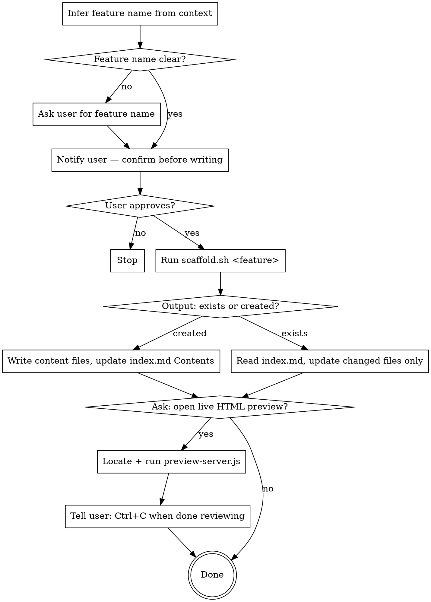

# Save Tech Spec

## Overview

Persists feature decisions, API contracts, implementation details, and quirks into a structured, queryable spec tree. One folder per feature, one file per concern — future sessions load only what they need.

## Spec Folder Layout

```
specs/
  {feature-slug}/           # kebab-case: WanConfig → wan-config
    index.md                # TOC, last updated, commit hash, changelog  ← scaffold creates this
    decisions.md            # Design decisions with context + rationale
    api.md                  # Endpoints, types, external APIs consumed
    fields.md               # Field mappings: BE/3rd-party → UI, or forwarding chains
    implementation.md       # Key files, patterns, how it hangs together
    quirks.md               # Edge cases, gotchas, known issues
```

Only create files that have actual content. Don't create empty files.

## Workflow



## Required Notifications

Always announce and confirm before writing or editing. Never silently modify files.

New spec:
```
About to save tech spec for `wan-config` → specs/wan-config/
Proceed? [y/n]
```

Updating existing spec:
```
Updating spec for `wan-config` (last saved: 2026-06-20, commit abc1234)
Files to update: decisions.md, quirks.md
Proceed? [y/n]
```

## Running the Scaffold Script

The script lives next to this skill file. Find it relative to where this SKILL.md was loaded from:

```bash
bash path/to/skill/references/scaffold.sh "WanConfig"
```

The script outputs one line:
- `created:specs/wan-config commit:abc1234 date:2026-06-24` — new spec, `index.md` written
- `exists:specs/wan-config commit:abc1234 date:2026-06-24` — spec already exists

Parse `commit` and `date` from the output — use them when writing or updating content files.

## After Scaffold: Writing Content Files

Read [references/templates.md](references/templates.md) for the structure of each file.

- Write only files that have real content
- After writing, update the `## Contents` section in `index.md` with links to the files you created

## Updating an Existing Spec

When scaffold output is `exists:`:
1. Read `index.md` to see current state and which files exist
2. Update only files with new or changed content
3. Bump `Last updated` and `Commit` in `index.md` using values from scaffold output
4. Append to the `## Changelog` in `index.md`

## Live HTML Preview (Optional)

After writing spec files, ask:

```
Spec saved. Want a live HTML preview? It renders diagrams, updates as you edit, and closes when you're done. [y/n]
```

If yes, locate the preview server script:

```bash
find ~/.claude ~/.agents -name "preview-server.js" -path "*/save-tech-spec/*" 2>/dev/null | head -1
```

Run it in the background, pointing at the spec folder:

```bash
node /path/to/preview-server.js specs/wan-config
```

It opens the browser automatically, watches for file changes, and re-renders live. Tell the user:

```
Preview running. Edit your spec files and the browser updates live.
Press Ctrl+C in the terminal to stop the server when you're done.
```

The server is in-memory only — no HTML files are written to disk. When the user stops it, everything is gone.

## Common Mistakes

| Mistake | Fix |
|---------|-----|
| Skipping the notification/confirmation | Always announce before writing, wait for approval |
| Not using scaffold output for date/commit | Parse them from the script — don't run git separately |
| Rewriting all files on update | Read `index.md` first, only touch files with new content |
| Vague decisions | Each decision needs context + rationale + consequences |
| Creating empty placeholder files | Only create a file when it has real content |
| Forgetting to update index.md Contents | Always link to files you create |
